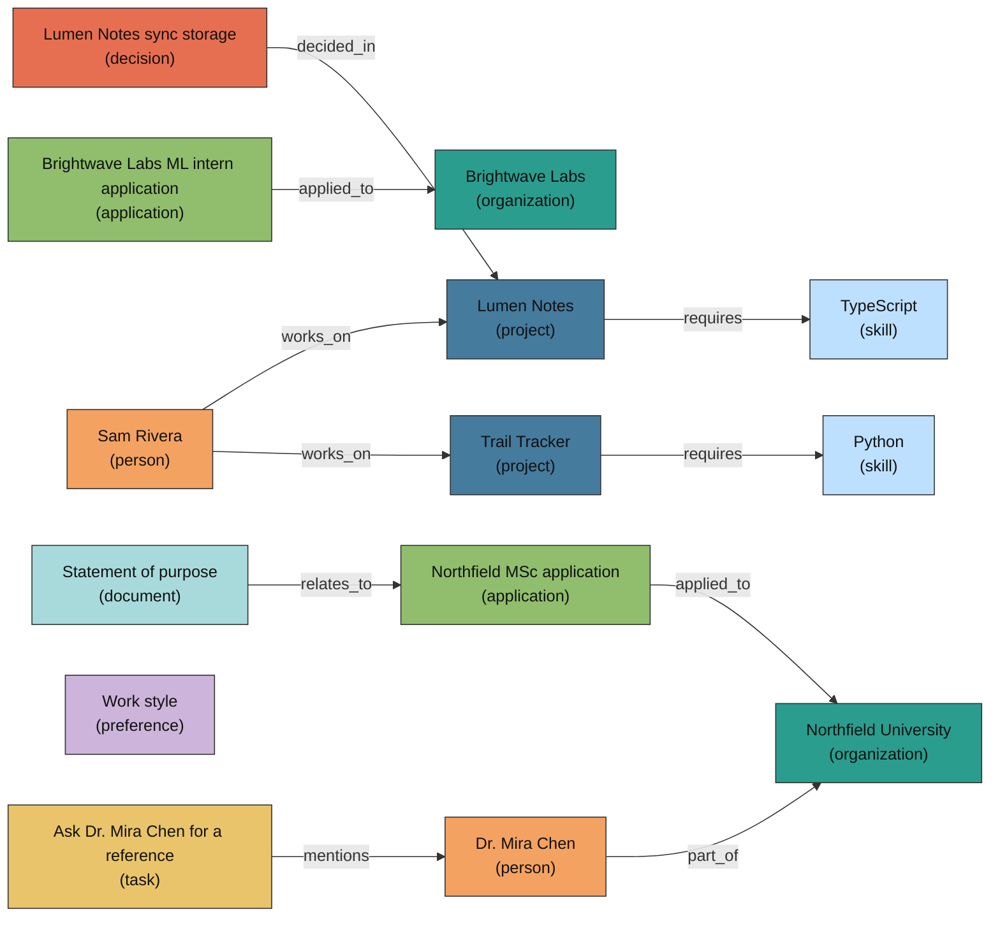

# Memory graph

14 active nodes, 10 edges between them. Generated by `room graph`.

```mermaid
flowchart LR
    n14["Brightwave Labs ML intern application<br/>(application)"]:::application
    n8["Northfield MSc application<br/>(application)"]:::application
    n15["Lumen Notes sync storage<br/>(decision)"]:::decision
    n16["Statement of purpose<br/>(document)"]:::document
    n7["Brightwave Labs<br/>(organization)"]:::organization
    n6["Northfield University<br/>(organization)"]:::organization
    n12["Dr. Mira Chen<br/>(person)"]:::person
    n1["Sam Rivera<br/>(person)"]:::person
    n13["Work style<br/>(preference)"]:::preference
    n4["Lumen Notes<br/>(project)"]:::project
    n5["Trail Tracker<br/>(project)"]:::project
    n2["Python<br/>(skill)"]:::skill
    n3["TypeScript<br/>(skill)"]:::skill
    n11["Ask Dr. Mira Chen for a reference<br/>(task)"]:::task
    n1 -->|works_on| n4
    n1 -->|works_on| n5
    n4 -->|requires| n3
    n5 -->|requires| n2
    n8 -->|applied_to| n6
    n12 -->|part_of| n6
    n11 -->|mentions| n12
    n14 -->|applied_to| n7
    n15 -->|decided_in| n4
    n16 -->|relates_to| n8
    classDef person fill:#f4a261,stroke:#333,color:#111
    classDef organization fill:#2a9d8f,stroke:#333,color:#111
    classDef project fill:#457b9d,stroke:#333,color:#111
    classDef decision fill:#e76f51,stroke:#333,color:#111
    classDef fact fill:#8d99ae,stroke:#333,color:#111
    classDef task fill:#e9c46a,stroke:#333,color:#111
    classDef document fill:#a8dadc,stroke:#333,color:#111
    classDef preference fill:#cdb4db,stroke:#333,color:#111
    classDef application fill:#90be6d,stroke:#333,color:#111
    classDef skill fill:#bde0fe,stroke:#333,color:#111
```
